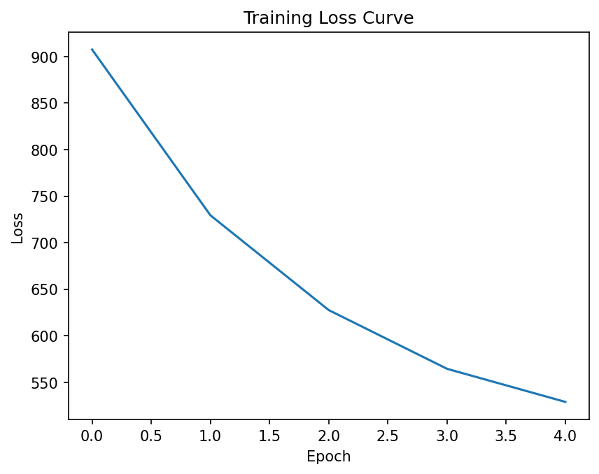
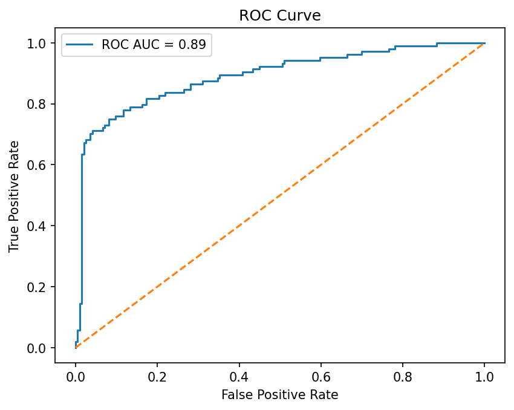
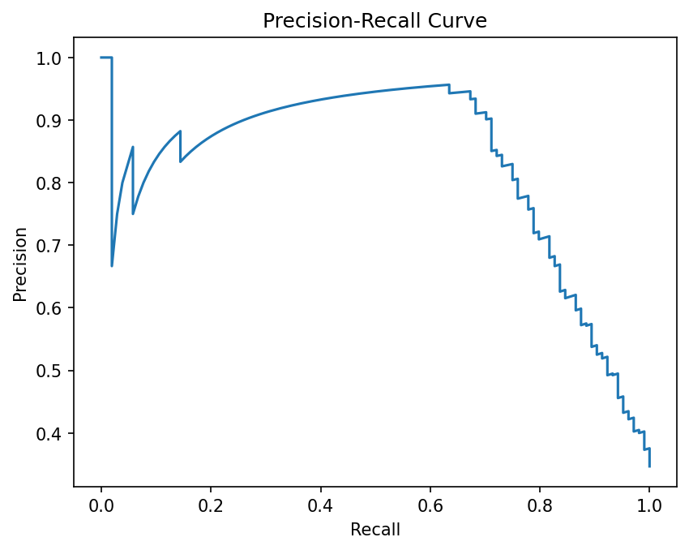

# ⚛️ DTIPredict — Drug–Target Interaction Predictor & ADMET Analyser


> A deep-learning pipeline to predict whether a small molecule drug will bind to a protein target, with full ADMET profiling and structural similarity search.

---

## 📋 Table of Contents

- [Overview](#overview)
- [Features](#features)
- [Model Architecture](#model-architecture)
- [Results](#results)
- [Project Structure](#project-structure)
- [Installation](#installation)
- [Usage](#usage)
  - [Streamlit App](#streamlit-app)
  - [Static Web Frontend](#static-web-frontend)
  - [Jupyter / Colab Notebook](#jupyter--colab-notebook)
- [Dataset](#dataset)
- [ADMET Analysis](#admet-analysis)
- [Evaluation Metrics](#evaluation-metrics)
- [Dependencies](#dependencies)
- [Contributing](#contributing)
- [License](#license)
- [Disclaimer](#disclaimer)

---

## Overview

DTIPredict takes a **drug SMILES string** and a **protein amino-acid sequence** as input and outputs:

1. **Binding probability** — a sigmoid score (0–1) indicating how likely the drug is to interact with the protein.
2. **ADMET profile** — Lipinski drug-likeness, Blood–Brain Barrier permeability, and heuristic toxicity assessment.
3. **Structurally similar drugs** — top-5 closest molecules from the training set ranked by Tanimoto fingerprint similarity.
4. **2D molecule visualisation** — rendered structure of the query molecule.

The model is trained on the **BindingDB Kd** dataset from the Therapeutics Data Commons (TDC), using a binding affinity threshold of **Kd < 1000 nM** to define positive interactions.

---

## Features

| Feature | Details |
|---|---|
| 🧠 Deep Learning Model | Transformer encoder + attention mechanism |
| 💊 Drug Representation | 1024-bit Morgan fingerprints (radius 2) via RDKit |
| 🧬 Protein Representation | Amino-acid embedding + 2-layer Transformer Encoder (4 heads, d=128) |
| 📊 ADMET Profiling | Lipinski Rule of Five, BBB permeability, heuristic toxicity |
| 🔍 Similarity Search | Tanimoto similarity against up to 200 training-set molecules |
| ⚛️ Molecule Visualisation | 2D structure rendered via RDKit / SmilesDrawer |
| 🌐 Multiple Interfaces | Streamlit app, static HTML/JS frontend, and Colab notebook |

---

## Model Architecture

```
Drug (SMILES)          Protein (AA sequence)
      │                        │
[Morgan FP, 1024-bit]   [AA → integer encoding]
      │                        │
[Linear → 256-d]         [Embedding → 128-d]
      │                        │
      │              [2-layer Transformer Encoder]
      │              [4 attention heads, d_model=128]
      │                        │
      │               [Attention pooling → 128-d]
      │                        │
      └──────── Concat (384-d) ─────────┘
                       │
              [FC 384→128, ReLU]
                       │
               [FC 128→1, Sigmoid]
                       │
             Interaction Probability
```

**Training details:**
- Dataset: BindingDB Kd — 2000 randomly sampled drug–target pairs
- Positive label: Kd < 1000 nM
- Train / test split: 80 / 20
- Epochs: 5
- Optimiser: Adam (lr = 0.001)
- Loss: Binary Cross-Entropy (BCELoss)

---

## Results

The model was evaluated on a held-out slice of 300 samples after 5 training epochs.

| Metric | Score |
|---|---|
| **Accuracy** | 0.873 |
| **F1 Score** | 0.791 |
| **ROC-AUC** | 0.888 |
| **PR-AUC** | 0.831 |

### Training Loss Curve
Loss dropped steadily across all 5 epochs, from ~910 down to ~522, indicating stable convergence.



### ROC Curve
The model achieves a ROC-AUC of 0.89, showing strong separability between binding and non-binding pairs.



### Precision-Recall Curve
Given class imbalance is common in binding datasets, PR-AUC (0.831) is reported alongside ROC-AUC for a fuller picture of performance.



> 📌 **Note:** Save the plots generated in the notebook (`losses`, `fpr`/`tpr`, `precision`/`recall`) as PNGs into an `assets/` folder before these images will render — see the notebook cells for the exact `plt.savefig(...)` calls to add.

---

## Project Structure

```
DeepDTI-Drug-Target-Interaction-Predictor-with-ADMET-Analysis/
├── Data/
│   └── dataset_loader.py
├── evaluation/
│   └── metrics.py
├── models/
│   └── dti_model.py
├── preprocessing/
│   ├── protein_encoder.py
│   └── smiles_to_fp.py
├── training/
│   └── train.py
├── utils/
│   ├── admet.py
│   ├── similarity.py
│   └── visualization.py
├── app/
│   ├── streamlit_app.py                        # Full Streamlit web application
│   ├── dti_predictor_with_admet_analysis.py     # Standalone Python script (Colab-derived)
│   └── static/
│       ├── index.html                           # Static frontend (HTML)
│       ├── app.js                                # Frontend logic (JavaScript)
│       └── style.css                             # Frontend styles (CSS)
├── notebooks/
│   └── DTI_Predictor_with_ADMET_Analysis.ipynb   # Original Jupyter / Colab notebook
├── assets/
│   ├── training_loss_curve.png
│   ├── roc_curve.png
│   └── pr_curve.png
├── requirements.txt                              # Python dependencies
├── packages.txt                                  # System-level packages (for Streamlit Cloud)
├── LICENSE
└── README.md                                     # This file
```

---

## Installation

### Prerequisites

- Python ≥ 3.9
- pip

### Steps

```bash
# 1. Clone the repository
git clone https://github.com/SHARIQUEanwar30/DeepDTI-Drug-Target-Interaction-Predictor-with-ADMET-Analysis.git
cd DeepDTI-Drug-Target-Interaction-Predictor-with-ADMET-Analysis

# 2. (Recommended) Create a virtual environment
python -m venv venv
source venv/bin/activate        # macOS / Linux
# venv\Scripts\activate         # Windows

# 3. Install Python dependencies
pip install -r requirements.txt
```

> **Note for macOS/Linux users:** RDKit molecule drawing requires the system libraries listed in `packages.txt`.
> Install them with:
> ```bash
> sudo apt-get install libxrender1 libxext6   # Debian / Ubuntu
> brew install libxrender libxext              # macOS (Homebrew)
> ```

---

## Usage

### Streamlit App

The recommended interface — a full interactive web app with tabbed results, gauge charts, and molecule images.

```bash
streamlit run app/streamlit_app.py
```

The app will open automatically at `http://localhost:8501`.

**App workflow:**
1. Choose a **Quick Example** (Aspirin, Caffeine, Ethanol) from the sidebar, or enter custom inputs.
2. Paste a **SMILES string** for your drug molecule.
3. Paste the **amino-acid sequence** of your target protein (max 512 residues used).
4. Click **⚡ Run Full Analysis**.
5. Explore results across five tabs: *Prediction · ADMET Profile · Molecule Structure · Similar Drugs · Model Metrics*.

---

### Static Web Frontend

A self-contained browser demo that runs entirely client-side — no Python required. Molecule drawing is handled by [SmilesDrawer](https://github.com/reymond-group/smilesDrawer).

```bash
# Simply open app/static/index.html in any modern browser
open app/static/index.html          # macOS
start app/static/index.html         # Windows
xdg-open app/static/index.html      # Linux
```

> The frontend simulates the model pipeline in JavaScript. Interaction probability, ADMET properties, and similar drugs are approximated locally without a backend server.

---

### Jupyter / Colab Notebook

Open `notebooks/DTI_Predictor_with_ADMET_Analysis.ipynb` directly in [Google Colab](https://colab.research.google.com/drive/10ynKW5Ad6J_ShsQ-kbR_2YQOXuDppSLs) or a local Jupyter server.

The notebook walks through the full pipeline step-by-step:
1. Dataset loading & preprocessing
2. Drug featurisation (Morgan fingerprints)
3. Protein encoding
4. Model definition & training
5. Evaluation (Accuracy, F1, ROC-AUC, PR-AUC)
6. Full drug analysis with ADMET & similarity search

---

## Dataset

| Property | Value |
|---|---|
| Source | [BindingDB Kd](https://www.bindingdb.org/) via [PyTDC](https://tdcommons.ai/) |
| Size used | 2000 randomly sampled pairs (seed = 42) |
| Positive label | Kd < 1000 nM (binding interaction) |
| Columns | `Drug` (SMILES), `Target` (AA sequence), `interaction` (0/1) |

---

## ADMET Analysis

ADMET properties are computed using **RDKit molecular descriptors**:

| Property | Descriptor | Threshold | Interpretation |
|---|---|---|---|
| Molecular Weight | `MolWt` | < 500 Da | Lipinski Rule 1 |
| LogP | `MolLogP` | < 5 | Lipinski Rule 2 |
| H-Bond Donors | `NumHDonors` | ≤ 5 | Lipinski Rule 3 |
| H-Bond Acceptors | `NumHAcceptors` | ≤ 10 | Lipinski Rule 4 |
| BBB Permeability | LogP > 2 | — | Heuristic estimate |
| Toxicity Risk | MolWt > 600 Da | — | Heuristic estimate |

All four Lipinski rules must pass for a molecule to be classified as **drug-like**.

---

## Evaluation Metrics

After training, the model is evaluated on a held-out slice (samples 500–800):

| Metric | Description |
|---|---|
| **Accuracy** | Fraction of correctly classified interactions |
| **F1 Score** | Harmonic mean of precision and recall |
| **ROC-AUC** | Area under the ROC curve |
| **PR-AUC** | Area under the Precision-Recall curve |

The Streamlit app displays these metrics live in the **Model Metrics** tab after the first run. See the [Results](#results) section above for the current benchmark numbers and plots.

---

## Dependencies

| Package | Purpose |
|---|---|
| `streamlit ≥ 1.35` | Web application framework |
| `torch ≥ 2.1` | Deep learning (Transformer, training loop) |
| `rdkit ≥ 2023.9.5` | Cheminformatics (fingerprints, ADMET, drawing) |
| `PyTDC ≥ 0.4.1` | BindingDB dataset loader |
| `numpy ≥ 1.24` | Numerical operations |
| `pandas ≥ 2.0` | Dataframe handling |
| `scikit-learn ≥ 1.3` | Train/test split, evaluation metrics |
| `matplotlib ≥ 3.7` | Training curves, ROC/PR plots |
| `Pillow ≥ 10.0` | Image rendering |

---

## Contributing

Contributions, issues, and feature requests are welcome. Feel free to open a pull request or file an issue if you'd like to improve the model, add new ADMET descriptors, or extend the interfaces.

---

## License

This project is licensed under the terms of the LICENSE file included in this repository.

---

## Disclaimer

> **Results produced by this tool are heuristic and intended for educational purposes only.**
> Interaction probabilities, ADMET estimates, and similarity scores are approximations derived from a small training set and simplified descriptors.
> **This tool is not intended for clinical, pharmaceutical, or diagnostic use.**
